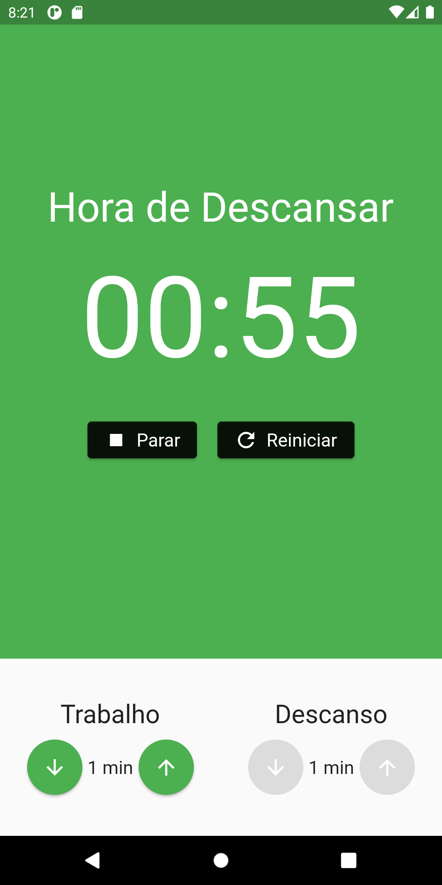
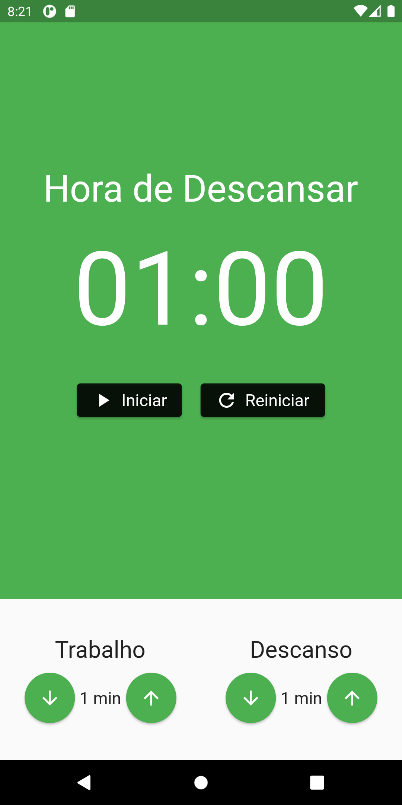
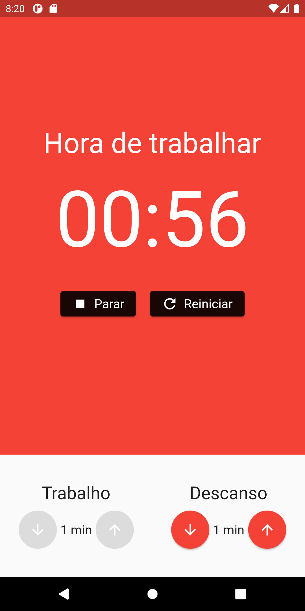
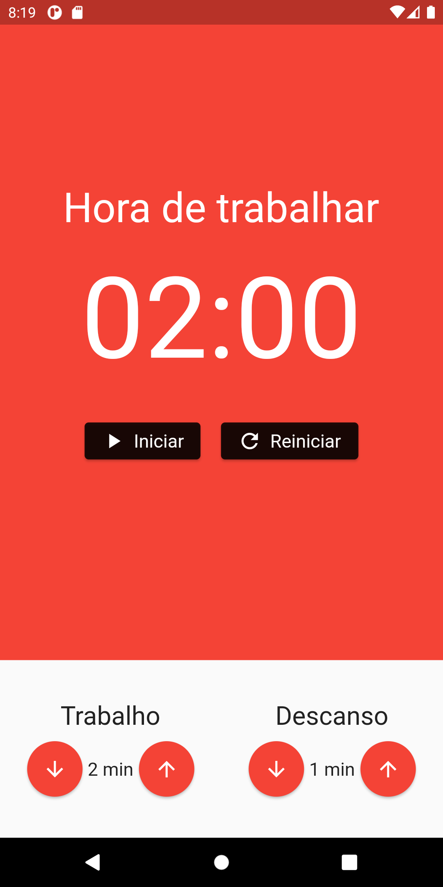

<h1 align="center">
<br>Pomodoro App
</h1>

<!---Esses são exemplos. Veja https://shields.io para outras pessoas ou para personalizar este conjunto de escudos. Você pode querer incluir dependências, status do projeto e informações de licença aqui--->

<div>
   <p align="center">
      Application that consists of using a stopwatch to divide work and rest into different periods.
  </p>
  <br>
 <div align="center">
    <a href="#">
      
    </a>
    <a href="#">
      
    </a>
  </div>
</div>

## 📱 Screens





## 🌐 Dependencies

* [mobx](https://pub.dev/packages/mobx)
* [flutter_mobx](https://pub.dev/packages/flutter_mobx)
* [provider](https://pub.dev/packages/provider)
* [cupertino_icons](https://pub.dev/packages/cupertino_icons)

## 💻 Dev-dependencies

* [build_runner](https://pub.dev/packages/build_runner)
* [mobx_codegen](https://pub.dev/packages/mobx_codegen)
* [flutter_lints](https://pub.dev/packages/flutter_lints)

## 🚀 Installation

To install the Pomodoro App, follow these steps:

Clone this project.
```
git clone https://github.com/Gianne-dev/pomodoro_app.git
```
Open folder and execute this commands.
```
flutter pub get
```
```
flutter run
```
Made with love by Gianne-dev❤️
